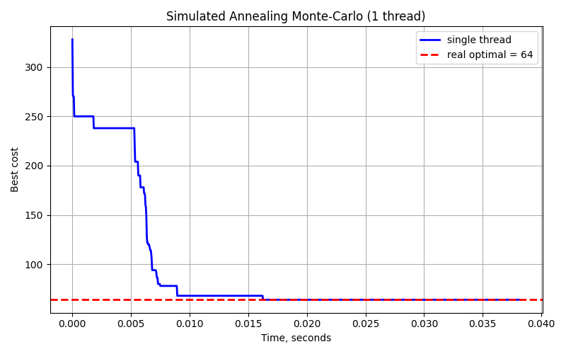
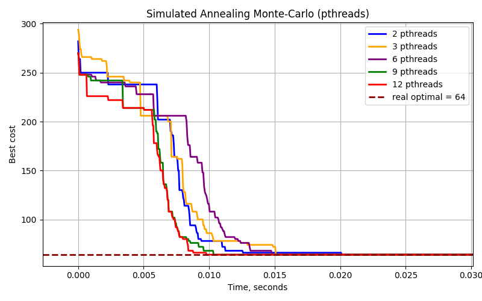
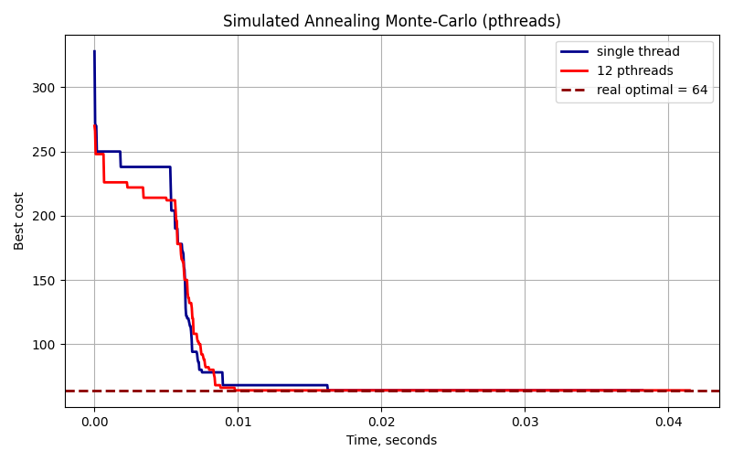
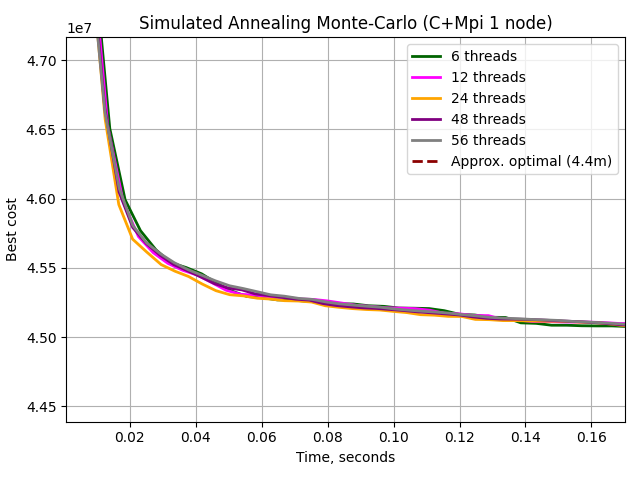
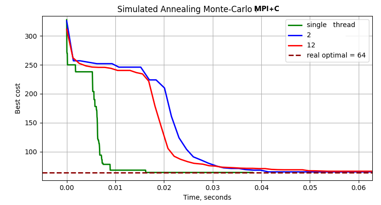
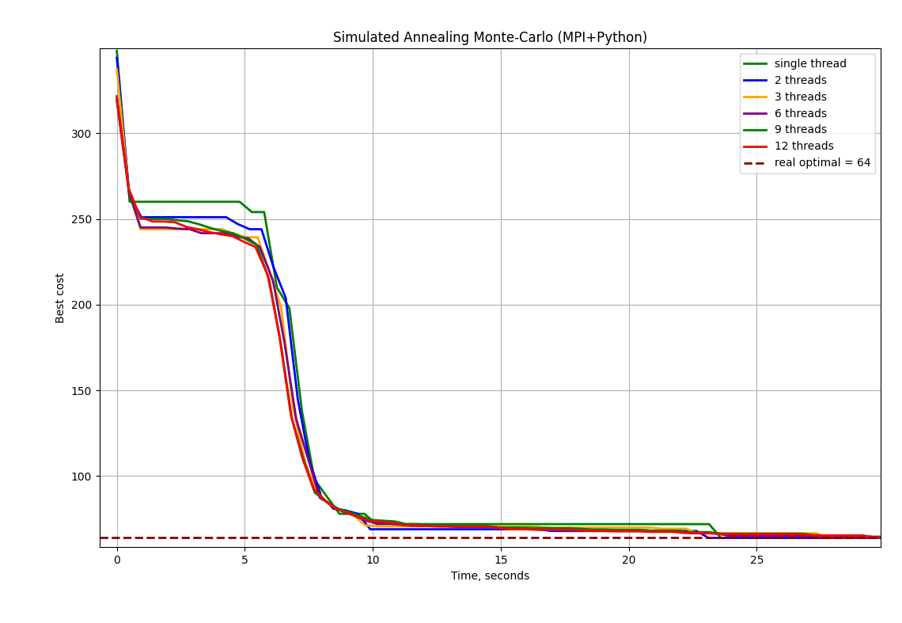
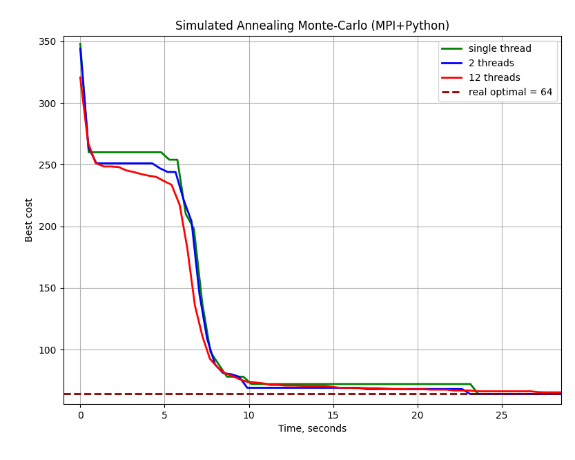
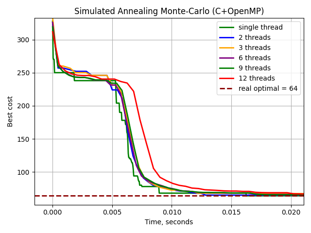
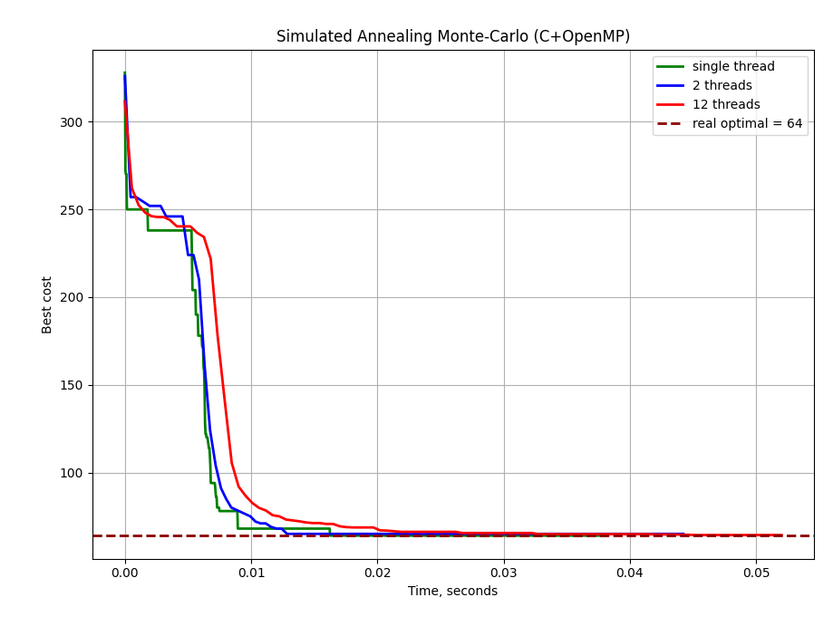
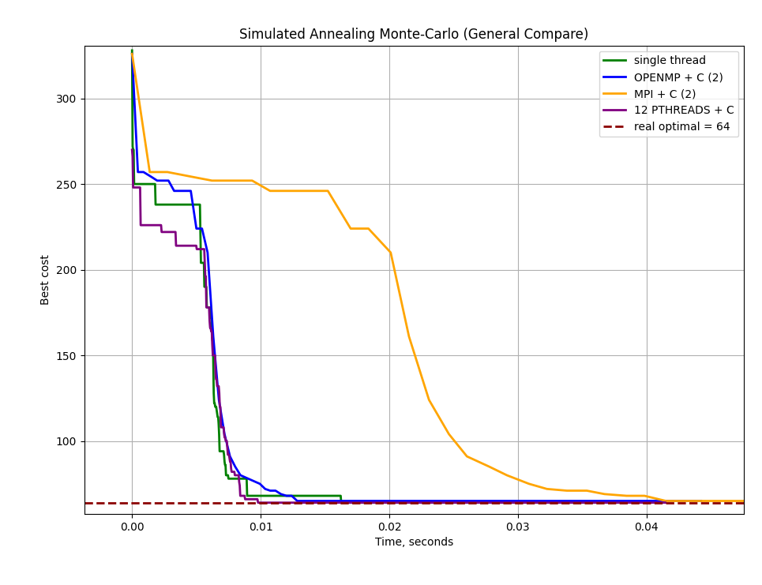

# Практическое задание 
- Дисциплина: *"Параллельное программирование на суперкомпьютерных системах"*
- Тема: *Алгоритм имитации отжига методом Монте Карло*
- Прикладная задача: Квадратичная задача о назначениях (Quadratic assignment problem)

# Введение
Цель работы - изучить особенности параллельной реализации вычислительных алгоритмов на разных технологиях параллелизма и сравнить их эффективность. Для выбранной вычислительной задачи требуется:
1. Выбрать прикладную задачу решаемую методом имитации отжига Монте-Карло.
2. Предложить алгоритм решения и рассмотреть возможные подходы распараллеивания. 
3. Провести ряд экспериментом и проанализировать полученные результаты.
4. Реализовать алгоритм четырьмя способами:

 - C + pthreads (Linux Native Threads);
 - C + MPI;
 - Python + MPI (mpi4py)
 - C + OpenMP


# Прикладная задача
Вот корректный, краткий и аккуратный раздел **«Прикладная задача»** с формулами в Markdown (KaTeX/MathJax-совместимые).

---

# Прикладная задача

Квадратичная задача о назначениях (Quadratic Assignment Problem, QAP) - классическая NP-полная комбинаторная оптимизационная задача.

Формулировка:
Дано два квадратных матрицы размера $ n \times n $:

* матрица потоков $ F = [f_{ij}] $, где $ f_{ij} $ - интенсивность взаимодействия между объектами $i$ и $j$;
* матрица расстояний $D = [d_{kl}]$, где $d_{kl}$ — расстояние между позициями $k$ и $l$.

Требуется найти перестановку
$$
\pi = {\pi(1), \pi(2), \dots, \pi(n)},
$$
которая минимизирует суммарную стоимость размещения объектов:

$$
\min_{\pi} ; C(\pi) =
\sum_{i=1}^{n}\sum_{j=1}^{n} f_{ij} \cdot d_{\pi(i),\pi(j)}.
$$
---

## Интерпретация задачи

Классический пример QAP — размещение цехов завода в заданных локациях.

* $f_{ij} $ — поток материалов между цехами $i$ и $j$;
* $ d_{kl} $ — расстояние между площадками $k$ и $l$;
* Нужно сопоставить каждый цех конкретной площадке так, чтобы минимизировать суммарные логистические затраты.

---

## Пример

Пусть $n = 3$.
Матрица потоков:

$$
F =
\begin{pmatrix}
0 & 5 & 2 \\
5 & 0 & 3 \\
2 & 3 & 0
\end{pmatrix}
$$

Матрица расстояний:

$$
D =
\begin{pmatrix}
0 & 4 & 1 \\
4 & 0 & 2 \\
1 & 2 & 0
\end{pmatrix}
$$

Если выбрать перестановку ( $\pi = (2,3,1)$ ), то стоимость:

$$
C(\pi) =
\sum_{i=1}^{3}\sum_{j=1}^{3}
f_{ij} \cdot d_{\pi(i),\pi(j)}.
$$

После подстановки вычисляется итоговое значение стоимости размещения.


# Алгоритм имитации отжига Монте-Карло

1. Дано: матрицы $F, D$; начальная температура $T$; начальная перестановка $\pi$; число итераций $K$.
2. Выход: стоимость пути $\pi_{best}$.

```
Для каждой итерации:
      a) Сгенерировать соседнее решение π' 
         (обмен двух случайных позиций).
      b) Вычислить Δ = C(π') − C(π).
      c) Если Δ ≤ 0, принять новую перестановку.
      d) Иначе принять с вероятностью exp(−Δ / T).
      e) Понизить температуру согласно T = T * α.
Вернуть найденное минимальное решение.
```

# Датасет
Рассматриваются наборы данных с сайта [qaplib](https://qaplib.mgi.polymtl.ca/), для представленных данных заданы матрицы потоков и расстояний. Приведены оптимальные решения для сравнения найденного решения.

# C + pthreads

В основном потоке создаем $N$ рабочих потоков (pthreads), каждый из которых получается независимые данные одинаковые входные данные. Это предотвращает необходимость синхронизации и исключает накладные расходы на блокировки. Каждый поток выполняет собственный независимый метод имитации отжига. После выполнения $K$ итераций производится поиск лучшего решения. 

# C + MPI / Python + MPI
Принцип параллелизма используется такой же как и в `C+pthreads`, особенностью реализации является передача данных с помощью `MPI_Bcast` также каждые 1000 итераций поток 0 передает лучшую перестановку другим процессам с некоторой вероятностью, чтобы ускорить процесс вычислений.


# C + OpenMP
Каждый поток OpenMP независимо выполняет полный цикл имитации отжига со своим и выбирается глобально лучшее решение. (Симметрично pthreads)

# Анализ результатов
Были проведены и поставлены эксперименты на входных данных `esc128.dat` ($N=128$) число запусков в каждом окружении: 10.


Число процессов в многопоточном режиме: 2, 3, 6, 9, 12.
## Single thread
В однопоточном режиме получены следующие результаты:



Среднее время сходимости решение: 0.0163 сек.
## C+pthreads
Для pthreads получены следующие результаты:



| Число потоков | Время достижения оптимума (сек) |
| ------------- | ------------------------------- |
| 2             | 0.020113                        |
| 3             | 0.015088                        |
| 6             | 0.014793                        |
| 9             | 0.010335                        |
| 12            | 0.009794                        |


График сравнения число потоков 12 и однопоточной версии:


В многопоточном режиме алгоритм сходится быстрее на 81% быстрее.

## MPI
### MPI + C

Для `MPI+C` получены следующие результаты:



| Число потоков | Время достижения оптимума (сек) |
| ------------- | ------------------------------- |
| 1             | 0.016343                        |
| 2             | 0.041503                        |
| 3             | 0.066943                        |
| 6             | 0.065011                        |
| 9             | 0.064402                        |
| 12            | 0.079488                        |


График сравнения 1, 2 и 12 потоков:



При обмене "лучшим" вариантом возникает место синхронизации потоков, за счет чего и снижается производительность алгоритма.

### MPI + Python
Для `MPI+Python` получены следующие результаты:



| Число потоков | Время достижения оптимума (сек) |
| ------------- | ------------------------------- |
| 1             | 23.594121                       |
| 2             | 23.111854                       |
| 3             | 27.796782                       |
| 6             | 27.889543                       |
| 9             | 29.58954                        |
| 12            | 29.69403                        |


График сравнения 1, 2 и 12 потоков:



Python версия демонстрирует слабое масштабирование, поскольку вычислительные затраты и высокая стоимость межпроцессных коммуникаций полностью перекрывают потенциальный выигрыш от параллелизма.


### OpenMP

Для `C+OpenMP` получены следующие результаты:



| Число потоков | Время достижения оптимума (сек) |
| ------------- | ------------------------------- |
| 1             | 0.016343                        |
| 2             | 0.012844                        |
| 3             | 0.022222                        |
| 6             | 0.022207                        |
| 9             | 0.022515                        |
| 12            | 0.032752                        |


График сравнения 1, 2 и 12 потоков:



OpenMP показывает ускорение только на малом числе потоков, а при дальнейшем увеличении производительности падает из-за роста накладных расходов и конкуренции потоков за общие вычислительные ресурсы.


## Сравнение лучших результатов
| Имплементация | Число потоков | Время достижения оптимума (сек) |
| ------------- | ------------- | ------------------------------- |
| Single thread | 1             | 0.016343                        |
| C + pthreads  | 12            | 0.009794                        |
| MPI + C       | 2             | 0.041503                        |
| C + OpenMP    | 2             | 0.012844                        |

Наилучшую производительность даёт pthreads-реализация на 12 потоках (используется независимая параллеизация без обмена между потоками). MPI и OpenMP эффективно масштабируются только при небольшом числе процессов из-за накладных расходов.




# Заключение
В работе были исследованы различные подходы к параллельной реализации алгоритма имитации отжига для решения квадратичной задачи о назначениях, с анализом их производительности и масштабируемости на современных многопроцессорных архитектурах.


Были реализованы две различные схемы параллелизма: с обменом между потоками и без. По проведенным численным экспериментам независимая схема показывает более эффективный результат (Pthreads + C (12  threads)).

